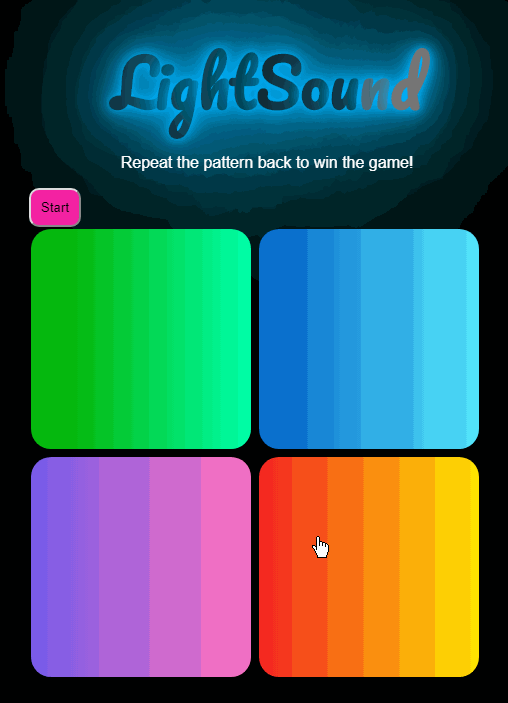

# Pre-work - _LightSound_

**LightSound** is a Light & Sound Memory game to apply for CodePath's SITE Program.

Submitted by: **Randy Alvarez**

Time spent: **8** hours spent in total

Link to project: https://glitch.com/edit/#!/silky-super-divan?path=README.md%3A8%3A9

## Required Functionality

The following **required** functionality is complete:

- [x] Game interface has a heading (h1 tag), a line of body text (p tag), and four buttons that match the demo app
- [x] "Start" button toggles between "Start" and "Stop" when clicked.
- [x] Game buttons each light up and play a sound when clicked.
- [x] Computer plays back sequence of clues including sound and visual cue for each button
- [x] Play progresses to the next turn (the user gets the next step in the pattern) after a correct guess.
- [x] User wins the game after guessing a complete pattern
- [x] User loses the game after an incorrect guess

The following **optional** features are implemented:

- [x] Any HTML page elements (including game buttons) has been styled differently than in the tutorial
- [x] Buttons use a pitch (frequency) other than the ones in the tutorial
- [ ] More than 4 functional game buttons
- [ ] Playback speeds up on each turn
- [ ] Computer picks a different pattern each time the game is played
- [ ] Player only loses after 3 mistakes (instead of on the first mistake)
- [ ] Game button appearance change goes beyond color (e.g. add an image)
- [ ] Game button sound is more complex than a single tone (e.g. an audio file, a chord, a sequence of multiple tones)
- [ ] User has a limited amount of time to enter their guess on each turn

The following **additional** features are implemented:

- [x] Animated Heading

## Video Walkthrough

 

## Reflection Questions

1. If you used any outside resources to help complete your submission (websites, books, people, etc) list them here.
   www.youtube.com, https://fonts.google.com/, https://cssgradient.io/, https://encycolorpedia.com/html, https://www.w3schools.com/css//css_font_websafe.asp
   https://cssreference.io/, https://www.w3schools.com/js/js_events.asp

2. What was a challenge you encountered in creating this submission (be specific)? How did you overcome it? (recommended 200 - 400 words)
   In trying to do the guess function without looking, specifically checking if your guess is the correct answer that at that turn and if your turn is over. In the end I looked because I was going down a completely different
   route where I started adding parameters. But the real change for me was trying to animate the heading. There are different ways of doing it such has doing it with JavaScript. But the easier way is with CSS. For animating
   some attribute you use the animation attribute where you specify the name of the animation function, how many times the animation will play (luckily it was as simple as "infinite"), what I think is the interpolation "linear."
   and how long the animation takes to play. I overcame that challenge through trial and error because for some reason there were attributes that were not responding so I just looked for others; those did not work either so
   I put them twice and then they worked? There was a lot of playing around with the animation function in CSS till I found how to access every individual letter in a word; once I got that animation-delay made sense. The switch
   from buttons to fancy HTML link elements was not too hard, I just had to be care-full of what selectors I changed in the stylesheet.

3. What questions about web development do you have after completing your submission? (recommended 100 - 300 words)
   I noticed you can forgo the JavaScript file and just do some of the logic inside the HTML. Do you need a JavaScript file is it optional, how much JS can put inside HTML tags? The same goes for the CSS, there are hover and
   active selectors you can add and then attributes are changed as a result, so what is the extent of CSS logic? Can there be any JS inside CSS? If you are a front-end developer do you work with JS or is JS back-end already? If you are a
   back-end developer do you even touch HTML or CSS, XML or are you just using things like Node.JS? What is the skill level generally needed, do you need to be a master of JS or 
   being well rounded with all three languages is enough?

4. If you had a few more hours to work on this project, what would you spend them doing (for example: refactoring certain functions, adding additional features, etc). Be specific. (recommended 100 - 300 words)
   If I had more time I would first make the game more difficult by implementing the playback feature speeding up after every turn, more buttons and the pattern changing every time you play the game. I would spend the time adding addition features
   that would improve the game and the look and feel. With the time I spent on it I focused on the look of the game since I thought that would be something I could figure out. Where as the computer generating a random pattern everytime
   would take much more time do I think. The pattern is a fixed array, so its easy to check some index in it. But if it where random everytime I think I would write a function that would generate that random array, generate some random number and set each index
   to that random number, return the array or set some global var to that array. Then call that function inside startGame() before playClueSequence() and change every instance of pattern to the new array, then again things are never as easy as they seem.

## License

    Copyright Randy Alvarez

    Licensed under the Apache License, Version 2.0 (the "License");
    you may not use this file except in compliance with the License.
    You may obtain a copy of the License at

        http://www.apache.org/licenses/LICENSE-2.0

    Unless required by applicable law or agreed to in writing, software
    distributed under the License is distributed on an "AS IS" BASIS,
    WITHOUT WARRANTIES OR CONDITIONS OF ANY KIND, either express or implied.
    See the License for the specific language governing permissions and
    limitations under the License.

## Made by [Glitch](https://glitch.com/)

\ ゜ o ゜)ノ
